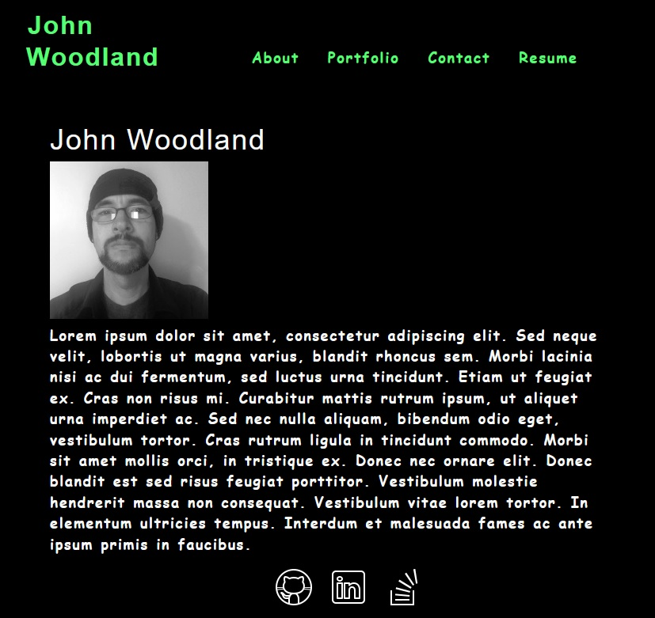

 

  <h1 align="center">John Woodland</h1>

## Description 

I am a full stack developer in training currently looking for employment.  Please click the link below to see my current portfolio and feel free to browse my current projects.  If you are a potential employer or if you have any questions, please e-mail me at <johntaylorwoodland@gmail.com>

## Table of Contents

* [Usage](#usage)
* [Contributing](#contributing)
* [Tests](#tests)
* [License](#license)
* [Questions](#questions)
* [Links](#links)

## Usage 

- Go [HERE](https://jondagamkd.github.io/) to take a look at my portfolio.

## Contributing

No contributions at this time please, but your are free to use this app in your own project given the license listed below.

## Tests

I welcome any tests or suggestions to better this portfolio in the future.

## License

This project is covered under the MIT license.

## Questions

I can be contacted via email or on github at:

* E-mail: johntaylorwoodland@gmail.com
* Github: https://github.com/jondagamkd/

## Links

- Go [HERE](https://jondagamkd.github.io/) to take a look at my portfolio.